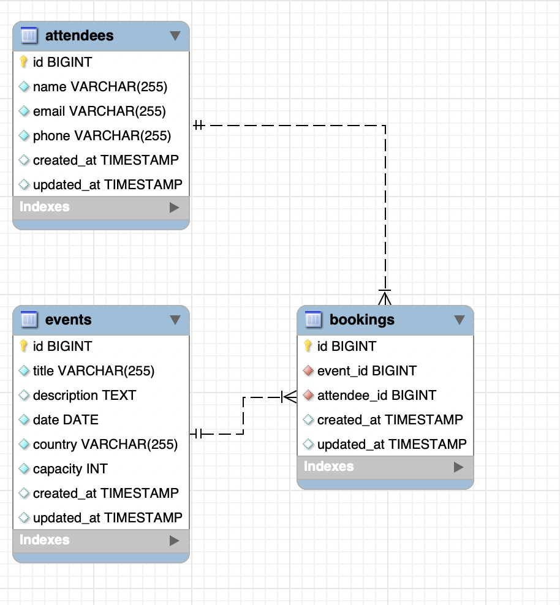
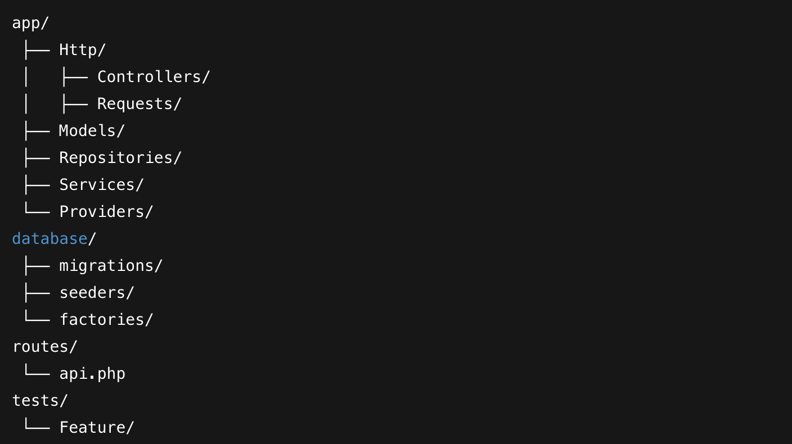
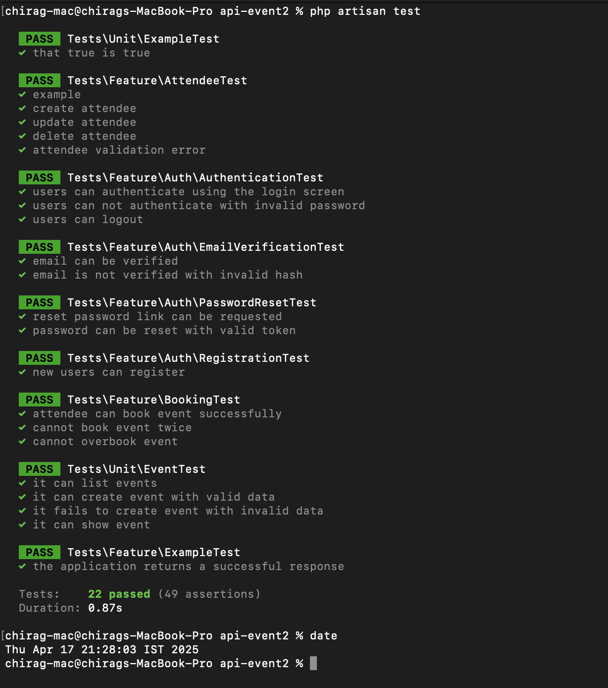

<p align="center"><a href="https://laravel.com" target="_blank"></a></p>

<p align="center">
<a href="https://github.com/laravel/framework/actions"></a>
<a href="https://packagist.org/packages/laravel/framework"></a>
<a href="https://packagist.org/packages/laravel/framework"></a>
<a href="https://packagist.org/packages/laravel/framework"></a>
</p> 

# 🎟️ Laravel Event Booking API

A RESTful API system built with Laravel 12 and MySQL that allows managing events, attendees, and event bookings with proper validation, pagination, filtering, structured responses, and test coverage.

---
 

## ✅ Features

- 🗓️ Event Management Api
- 👥 Attendee Management Api
- 📅 Event Booking System Api
  - Prevent **duplicate bookings**
  - Prevent **overbooking**
- 🧾 Request Validation
- ✅ Structured JSON API Responses
- 🔍 Pagination & Filtering
- 🧱 Repository + Service Layer Architecture
- 🧪 Unit Tests for all core features
- 🧼 Postman API Documentation
- ⚙️ Test and Factories

---

## 📦 Tech Stack

- **Laravel 12**
- **MySQL** 
- **PHPUnit**
- **Repository + Service Design Patterns**

---

## 📁 Installation & Setup

### 1️⃣ Clone the Repository
```
git clone https://github.com/your-username/event-booking-api.git
cd event-booking-api 
```

### 2️⃣ Install Dependencies
```
composer install
```

### 3️⃣ Set Environment Variables
```
cp .env.example .env
php artisan key:generate
```

Update your .env with DB credentials:
```
DB_CONNECTION=mysql
DB_HOST=127.0.0.1
DB_PORT=3306
DB_DATABASE=event_booking
DB_USERNAME=root
DB_PASSWORD=your_password
```

### 4️⃣ Run Migrations
```
php artisan migrate
```

### 6️⃣ Start Development Server
```
php artisan serve
```

### 7️⃣ Postman APIs Documentation
[API Documentation postman LINK](https://documenter.getpostman.com/view/28228721/2sB2cd3dBn)


---

## 🚀 API Endpoints

### 🗓️ Events
- `GET /api/events` — List events with filters & pagination  
- `POST /api/events` — Create new event  
- `PUT /api/events/{id}` — Update an existing event  
- `DELETE /api/events/{id}` — Delete an event  

### 👥 Attendees
- `GET /api/attendees` — List attendees with pagination & search  
- `POST /api/attendees` — Register new attendee  
- `PUT /api/attendees/{id}` — Update an attendee  
- `DELETE /api/attendees/{id}` — Delete an attendee  

### 📅 Bookings
- `POST /api/bookings` — Book an attendee to an event  
  - ✅ Validates event capacity (no overbooking)  
  - ✅ Prevents duplicate bookings  
- `GET /api/bookings` — List bookings with pagination
- `DELETE /api/bookings/{id}` — Delete an bookings  

---

## 🔍 Filters & Pagination

- `GET /api/events?country=India` — Filter events by country  
- `GET /api/attendees?name=john` — Search attendees by name/email/phone  
- `GET /api/events?page=2&per_page=10` — Paginate events  

---

## 🧱 Design Patterns Used

- **Repository Pattern** – Clean abstraction over database logic  
- **Service Layer** – Business rules are handled outside controllers  
- **Request Validation** – Validates incoming payloads  
- **Swagger Annotations** – Auto-generated OpenAPI documentation  
- **Factory Pattern** – Used in testing and facker data  

---

## 🧪 Testing

### Run All Tests

```
php artisan test
```

---

## ✅ Covered Cases

- ✅ **Successful Event Booking**
- 🚫 **Duplicate Booking Prevention**
- 🚫 **Overbooking Prevention**
- ❌ **Validation Failures**
- ✅ **CRUD for Events and Attendees**

---

## 📊 Database Schema (ER Diagram)



---

## 📷 See ER Diagram:

[📸 Include ER Diagram Image Here or Link to Diagram Tool]

---

## 📂 Project Structure


 
## 📂 Test Cases Results 




## License

The Laravel framework is open-sourced software licensed under the [MIT license](https://opensource.org/licenses/MIT).

